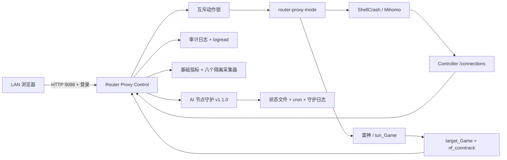

# Router Proxy Control

运行在小米 ARM64 路由器上的轻量 Web 控制台，用于安全地切换 ShellCrash/Mihomo 与雷神游戏加速插件，并管理 AI 美国线路守护、查看实时网络会话、资源状态及故障日志。

> 0.7.0 使用能力探测和显式配置覆盖，同一份静态 ARM64 二进制已适配 AX9000 与 BE10000。代理切换仍依赖目标机上经过验证的 `/usr/bin/router-proxy-mode`。
>
> 0.8.0 新增八个隔离采集器、运行期缓存和设备能力栏目，并把节点守护 v1.1.0 的首次基线与回滚状态接入控制台。

## 功能

- 手动启动、停止、重启和切换 ShellCrash、雷神服务。
- 从雷神服务卡片手动启动更新检查；只允许在 ShellCrash 或全部停止模式执行，并在外接存储上保留更新前程序。
- 强制保持两套 TUN/iptables 服务互斥，避免双重接管。
- 每 2 秒刷新服务状态、CPU、内存、存储、关键接口速率和活动网络会话。
- 独立资源监控栏目展示内部数据分区与外接存储（挂载点自动发现），以及 WAN、LAN、代理隧道和无线接口的实时收发速率与累计流量。
- 八个独立采集器展示 10G/2.5G 链路、温度、风扇、USB、Docker、Swap、PPPoE 与 Mesh 新鲜度；单项失败、超时或不支持不会拖慢基础指标。
- 自动读取小米 Mesh v2 拓扑缓存，展示主从角色、节点位置、管理地址、有线/无线回程及链路质量。
- 桌面端左侧导航与手机端横向栏目将总览、资源、节点守护、会话和日志分开，只轮询当前所需数据。
- 有线互联接口**自动发现，不写死接口名**：扫描 sysfs 得到物理以太网口，并从 UCI `network` 解析 WAN 绑定设备来标注角色，因此同一份程序可同时适配千兆机型与 2.5G/万兆机型。链路状态、协商速率及双工模式实时展示，低速活跃链路会醒目标记；聚合成员与 `bond` 逻辑口按内核主从关系动态区分。
- ShellCrash 会话来自 Mihomo Controller API。
- 雷神会话来自 `target_Game` 设备集合与 Linux conntrack。
- 操作审计和路由器系统日志集中展示，敏感字段自动脱敏。
- 目标服务启动失败时自动恢复切换前模式。
- 登录限流、内存会话、CSRF 校验、LAN 单地址监听。
- 登录后可修改管理密码；保存成功后自动注销所有旧会话。
- 集成 AI 节点守护：展示健康状态、三条优先线路、OpenAI/Claude/GitHub 探测结果和最近日志。
- 可从控制台立即执行线路检查，或启用、暂停路由器本机每 30 分钟调度。
- 提供脱敏诊断信息复制功能。
- procd 常驻和开机自启；程序放在 U 盘，内部闪存仅保存小型配置与启动器。
- 针对重启时重建 `/etc/init.d` 的固件，在 `/data` 保存 init 副本并由轻量 cron 守护按需恢复。
- 前端完全离线，不加载 CDN、字体或第三方 JavaScript。

## 已验证环境

| 项目 | 环境 |
|---|---|
| 路由器 | Xiaomi AX9000 / RA70；Xiaomi 万兆路由器 BE10000 / RC01 |
| 固件 | AX9000 `1.0.168`；BE10000 `1.1.56` |
| CPU / OS | `aarch64` / Linux 4.4.60 与 5.4.164 |
| ShellCrash | 1.9.4 |
| Mihomo | 1.19.17 |
| 雷神插件 | `acc-gw.router.arm64`，TUN 模式 |
| 切换命令 | `/usr/bin/router-proxy-mode` |
| Web 地址 | `http://<路由器 LAN 地址>:9098/` |

> 0.7.0 起，有线接口、外接存储、Docker、温度/风扇传感器和 Mesh 状态文件均在启动时探测并缓存。完整规则、覆盖项与 BE10000 配置示例见 [机型适配说明](docs/model-adaptation.md)，运行期采集规则见 [资源采集器的数据源与降级策略](docs/collectors.md)。

## 工作方式



控制台本身不重新实现服务切换逻辑，而是调用已经验证过的 `router-proxy-mode shellcrash|leigod|off`。所有写操作串行执行，并在完成后检查目标进程和互斥状态。

雷神更新按钮调用配置的 `leigod_update_command`。BE10000 上该入口会在 U 盘先备份当前闭源二进制，再将厂商 `-r upgrade` 检查限制在三分钟内；更新后若程序缺失、不可执行或不是 ELF，会自动恢复更新前版本。

## 资源设计

- 单个静态 ARM64 Go 二进制，无 Python、Node.js 或数据库依赖。
- 静态页面嵌入二进制，不额外运行 Web 服务器。
- 仅在浏览器打开时产生轮询请求。
- conntrack 只读取一次并限制最多返回 300 行。
- 日志保存在内存和系统环形日志中，不持续写入路由器闪存。
- 通过 `nice -n 10` 低优先级运行。

## 构建

需要 Go 1.24 或更高版本：

```sh
CGO_ENABLED=0 GOOS=linux GOARCH=arm64 \
  go build -trimpath -ldflags='-s -w' \
  -o build/router-proxy-control-linux-arm64 .

CGO_ENABLED=0 GOOS=linux GOARCH=arm64 \
  go build -trimpath -ldflags='-s -w' \
  -o build/router-ai-node-guard-linux-arm64 ./cmd/router-ai-node-guard
```

运行测试：

```sh
go test -race ./...
go vet ./...
```

## macOS 一键部署

前提：

1. `~/.ssh/config` 中存在目标路由器主机配置，或 `ROUTER_HOST` 可直接解析。
2. 路由器 root 密码保存在 macOS 钥匙串：
   - 服务：自定义名称，例如 `router-proxy-control-ssh`
   - 账户：`root`
3. 已安装 `sshpass` 和 Go。
4. 已插入可写的持久化外接存储；安装器会自动选择，也可通过 `EXTERNAL_STORAGE` 覆盖。

执行，示例地址请替换为自己的路由器 LAN 地址；钥匙串服务名也可以自定义：

```sh
ROUTER_HOST="router" \
ROUTER_LAN_IP="192.168.50.1" \
ROUTER_KEYCHAIN_SERVICE="router-proxy-control-ssh" \
CONTROL_KEYCHAIN_SERVICE="router-proxy-control-admin" \
./scripts/deploy-macos.sh
```

可配置环境变量：

| 变量 | 默认值 | 用途 |
|---|---|---|
| `ROUTER_HOST` | 必填 | `~/.ssh/config` 中的路由器别名或地址 |
| `ROUTER_LAN_IP` | 必填 | 路由器 LAN IPv4 地址，仅用于首次生成配置 |
| `CONTROL_PORT` | `9098` | Web 控制台端口 |
| `LISTEN_ADDRESS` | `<ROUTER_LAN_IP>:<CONTROL_PORT>` | 完整监听地址 |
| `EXTERNAL_STORAGE` | 自动发现 | 程序和备份所在的外接存储根 |
| `ROUTER_KEYCHAIN_SERVICE` | `router-proxy-control-ssh` | 路由器 SSH 密码所在的钥匙串服务名 |
| `CONTROL_KEYCHAIN_SERVICE` | `router-proxy-control-admin` | 初始管理密码所在的钥匙串服务名 |

脚本会：

1. 交叉编译 Linux ARM64 二进制。
2. 首次安装时生成独立控制台密码，并保存到配置的 macOS 钥匙串服务。
3. 只把随机盐和密码哈希写入路由器，不上传明文密码；升级时保留路由器上的现有配置和已修改密码。
4. 备份旧版本并原子替换程序。
5. 注册 `/etc/init.d/router-proxy-web`，启用 procd 开机自启。
6. 从配置读取监听地址并验证端口已打开。

首次登录时，在 macOS“钥匙串访问”中查看所配置管理密码服务的 `admin` 密码。

## 修改管理密码

登录控制台后，点击右上角“修改密码”：

1. 输入当前密码。
2. 输入两次新密码；长度为 8–128 个字符，可以使用容易记忆的中文或英文短语。
3. 保存后所有已登录设备都会退出，再使用新密码登录。

修改过程会生成新的随机盐，并原子更新 `/data/router-proxy-web/config.json`。路由器仍然只保存哈希，不保存明文。通过网页修改的密码不会回写到 Mac 钥匙串，但以后运行部署脚本会保留路由器现有密码，不会被钥匙串中的初始密码覆盖。

## 路由器目录

| 路径 | 用途 |
|---|---|
| `<external_storage>/router-proxy-control/bin/` | 主程序，减少内部闪存占用 |
| `<external_storage>/router-proxy-control/backups/` | 每次升级前的旧版本备份 |
| `/data/router-proxy-web/config.json` | 监听地址、密码哈希和运行参数，权限 600 |
| `/data/router-proxy-web/launcher.sh` | 等待 U 盘后启动主程序 |
| `/etc/init.d/router-proxy-web` | procd 服务入口 |
| `<external_storage>/ShellClash/tools/router-ai-node-guard` | AI 美国线路静态 ARM64 守护程序 |
| `<external_storage>/ShellClash/tools/ai-node-guard-state.json` | 守护状态与最近探测结果 |
| `<external_storage>/ShellClash/logs/ai-node-guard.log` | 守护运维日志 |
| `/etc/crontabs/root` | 每 30 分钟守护调度 |

## 安全边界

- 只绑定配置中的路由器 LAN 地址，不监听 WAN 地址或 IPv6。
- 严格校验 HTTP Host，只接受配置的监听地址，降低局域网 DNS Rebinding 风险。
- 登录密码与路由器 root 密码相互独立。
- Cookie 使用 HttpOnly 和 SameSite Strict；写操作需要 CSRF Token。
- 5 分钟内连续失败 5 次会临时停止接受该 IP 的登录。
- 不向浏览器返回 Mihomo 控制器密钥、订阅地址或配置文件内容。
- 切换输出和日志会遮蔽 `token`、`secret`、`password` 与 Authorization 字段。
- 不要为 9098 添加端口转发，也不要把控制台反向代理到公网。

局域网 HTTP 本身不提供链路加密。如果需要跨网络管理，应先通过可信 VPN 回到家庭 LAN，不应直接暴露 9098。

## 会话数据说明

### ShellCrash

从本机 Mihomo Controller `/connections` 读取：来源、目标、域名、协议、命中规则、代理链及上传/下载字节。

### 雷神

雷神没有公开的会话查询接口。控制台读取 `target_Game` ipset，再从 `/proc/net/nf_conntrack` 筛选这些设备发起的 IPv4 会话。因此可以看到协议、连接状态、源/目标地址、端口和超时，但无法获得雷神节点名称或单连接字节数。

## 故障与自动回滚

切换目标服务后会检查：

- 模式文件是否与目标一致。
- ShellCrash 的 `CrashCore` 是否运行。
- 雷神 daemon 和 Web 进程是否同时运行。
- 另一套互斥服务是否已经退出。

50 秒内未达到健康状态会显示错误，并在 `auto_rollback=true` 时恢复切换前模式。控制台日志同时收集自身审计信息和 `logread` 中与 ShellCrash、Mihomo、雷神相关的记录。

若控制台自身异常，不影响现有代理服务，可以继续通过 SSH 使用：

```sh
router-proxy-mode status
router-proxy-mode shellcrash
router-proxy-mode leigod
router-proxy-mode off
```

## 卸载

将 `scripts/uninstall-router.sh` 上传到路由器后执行。卸载脚本会停止并删除控制服务和内部配置，但会保留 U 盘中的程序备份，方便恢复。

## API 概览

| API | 方法 | 说明 |
|---|---|---|
| `/api/login` | POST | 控制台登录 |
| `/api/password` | POST | 校验当前密码并修改管理密码 |
| `/api/status` | GET | 模式、进程、TUN、内存和负载 |
| `/api/system-metrics` | GET | CPU、内存、存储和关键网络接口实时指标 |
| `/api/sessions` | GET | ShellCrash 或雷神实时会话 |
| `/api/logs` | GET | 审计及系统日志 |
| `/api/diagnostics` | GET | 脱敏诊断快照 |
| `/api/action` | POST | 启动、重启、切换或全部停止 |
| `/api/node-guard` | GET | 守护运行、调度、节点、探测和日志状态 |
| `/api/node-guard/action` | POST | 立即检查、启用或暂停定时调度 |

除登录外，所有 API 都需要有效会话；写操作还需要 CSRF Token。
